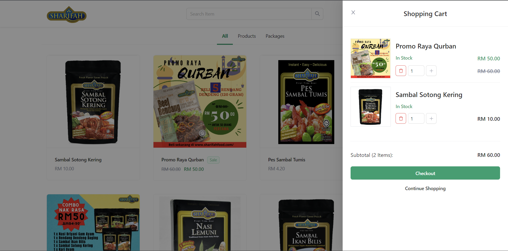

# E-commerce Platform
<!-- ALL-CONTRIBUTORS-BADGE:START - Do not remove or modify this section -->
[](#contributors-)
<!-- ALL-CONTRIBUTORS-BADGE:END -->

## Overview

Sharifah Food is a food processing company that specialises in the ready meals market. Over the years, Sharifah Food had to manually take orders from its customer through WhatsApp and record the sales data in Excel sheets. Nevertheless, it was discovered that it became difficult to keep track of all sales, orders, and inventory as the company grew. Therefore, this project aims to implement a responsive e-commerce platform to integrate with the [computerised inventory management system](https://github.com/yuanjie8629/FYP-InvMgmtSys) to further streamline the company's business.

#### Multi-level Marketing System

Sharifah Food applies Multi-level Marketing (MLM) system to sell its products. The customers can apply as **agents** or **dropshippers** to promote and sell the company's products by purchasing the products at discounts. For instance, an agent and a dropshipper can receive 30 percent and 20 percent discounts, respectively, if they order a large quantity of products.

## Demo :rocket:

##### NOTE: This project is only for demonstration purposes. Please do not enter any sensitive information on the website.

https://fyp-shrf-ecommerce.herokuapp.com/

###### \*Might take some time to wake up the system due to inactivity

## Features

1. Register as Customer<br>
   Although users can use the system without registering, they can register as customers to enjoy all available features.

2. Register as Agent or Dropshipper<br>
   The users can register as agents or dropshipper by filling the registration form on the website. However, users who have submitted the registration form are not compulsory becoming as agents or dropshippers. The decision lies with the stockist (admin).

3. Login<br>
   The users who have registered can log in to the system using their emails and passwords.

4. Promotional Packages Management<br>
   The admin can manage the promotions by adding new promotional packages as well as modifying and deleting the existing promotional packages.

5. Profile Management<br>
   The registered users can manage their profiles by changing their current password, email, gender, adding and saving addresses for future orders, etc.

6. Browse Items<br>
   The users can view all the products and promotions sold by the company through the website and mobile application.

7. View Item<br>
   The users can view the details of the item by selecting the item while browsing. All the information about the item will be displayed to the user.

8. Add item to Shopping Cart<br>
   The users can add the items to their shopping carts. The shopping cart can contain as many items as the user wants, but it cannot store out-of-stock items. Also, the cart can only be kept for unregistered users until the cache of their devices is cleared.

9. Search Item<br>
   The users can search for items by entering the keywords of the items.

10. Order History<br>
    The users can search for the order by entering their email and order number, which can be found in the order confirmation email. In case of the registered users, They can view the list of their order history on the order history page.

11. Checkout Order<br>
    The users can check out the items in their shopping cart. Users can also confirm their delivery address, order summary and payment methods before paying their orders. Unregistered or registered users without shipment details will have to enter the shipment details.

12. Payment<br>
    The users can pay for their orders during the checkout process. Two methods of payment are available: Credit or debit card and FPX online banking. The payment process is integrated with Stripe as a payment gateway.

13. Notification<br>
    The system automatically notifies the users of the order updates via email.

## Tech Stack

- [Django (Python)](https://www.djangoproject.com/)
- [React TypeScript](https://create-react-app.dev/docs/adding-typescript/)
- [PostgreSQL (with Heroku)](https://www.postgresql.org/)
- [Redis (with Heroku)](https://redis.io/)
- [Stripe](https://stripe.com/)
- [Cloudinary](https://cloudinary.com/)
- [Gmail SMTP](https://mail.google.com/mail/)
- [Ant Design](https://ant.design/)
- [LESS](https://lesscss.org/)
- [Heroku](https://www.heroku.com/)
- [Progressive Web Application (PWA)](https://web.dev/progressive-web-apps/)

## System Design

### System Architecture

<br>

### Use Case Diagram

<br>

### Conceptual ERD

<br>

### Logical ERD

<br>

### Physical ERD

<br>

## Installation

### Prerequisites

- SQL Database
- [Cloudinary Account](https://cloudinary.com/)
- [Stripe Account](https://stripe.com/)
- SMTP Account
- [Redis](https://redis.io/)
- [Python 3.10.2](https://www.python.org/downloads/release/python-3102/)
- [Yarn](https://yarnpkg.com/)

### Installation Steps

1. Install the frontend packages using yarn.
   ```
    yarn install
   ```
2. Install the backend packages using pip from requirements.txt.
   ```
   pip install -r requirements.txt
   ```
3. Create .env to configure environment variables as follows:
   ```
   ALLOWED_HOSTS=<any hosts seperated by ","> ('127.0.0.1,localhost')
   CORS_ORIGIN_WHITELIST=<any origin seperated by ","> ('http://localhost:3000,http://127.0.0.1:3000')
   CSRF_TRUSTED_ORIGINS=<any origin seperated by ",">
   CLOUDINARY_NAME=<your cloudinary name>
   CLOUDINARY_API_KEY=<your cloudinary api key>
   CLOUDINARY_API_SECRET=<your cloudinary api secret>
   DATABASE_NAME=<your database name>
   DATABASE_USER=<your database user>
   DATABASE_PASSWORD=<your database password>
   DATABASE_HOST=<your database host>
   DATABASE_PORT=<your database port>'
   DEBUG=True
   EMAIL_HOST_USER=<your email to send notification>
   EMAIL_HOST_PASSWORD=<your email SMTP password>
   REDIS_TLS_URL=<your Redis TLS url>
   REDIS_URL=<your Redis url>
   SECRET_KEY=<django app secret key>
   STRIPE_PUBLISHABLE_KEY=<your Stripe publisable key>
   STRIPE_SECRET_KEY=<your Stripe secret key>
   STRIPE_WEBHOOK_SECRET=<your Stripe webhook secret key>
   ```
4. Migrate your database.
   ```
   python manage.py migrate
   ```
5. Build the React App using yarn.
   ```
   yarn build
   ```
6. Run the server.
   ```
   python manage.py runserver
   ```

## Preview

1. Register as Customer <br> <br><br>
2. Register as Agent or Dropshipper <br> <br><br>
3. Login <br> <br><br>
4. Browse Items <br> <br><br>
5. View Item <br> <br><br>
6. Shopping Cart <br> <br><br>
7. Address Book<br> <br><br>
8. Checkout Order<br> <br><br>
9. Order History <br> <br><br>
10. Search Order <br> <br><br>
11. Order Details <br> <br><br>
12. Profile Management <br> <br><br>
13. PWA Installation <br> <br><br>

## Documentation

### Poster

https://tinyurl.com/YJFYPPOSTER

### Report

https://tinyurl.com/YJFYP

## Contributors ✨

Thanks goes to these wonderful people ([emoji key](https://allcontributors.org/docs/en/emoji-key)):

<!-- ALL-CONTRIBUTORS-LIST:START - Do not remove or modify this section -->
<!-- prettier-ignore-start -->
<!-- markdownlint-disable -->
<table>
  <tr>
    <td align="center"><a href="https://github.com/yuanjie8629"><br /><sub><b>Tan Yuan Jie</b></sub></a><br /><a href="#a11y-yuanjie8629" title="Accessibility">️️️️♿️</a> <a href="#question-yuanjie8629" title="Answering Questions">💬</a> <a href="https://github.com/yuanjie8629/E-commerce Platform/issues?q=author%3Ayuanjie8629" title="Bug reports">🐛</a> <a href="https://github.com/yuanjie8629/E-commerce Platform/commits?author=yuanjie8629" title="Code">💻</a> <a href="#data-yuanjie8629" title="Data">🔣</a> <a href="#design-yuanjie8629" title="Design">🎨</a> <a href="https://github.com/yuanjie8629/E-commerce Platform/commits?author=yuanjie8629" title="Documentation">📖</a> <a href="#example-yuanjie8629" title="Examples">💡</a> <a href="#ideas-yuanjie8629" title="Ideas, Planning, & Feedback">🤔</a> <a href="#infra-yuanjie8629" title="Infrastructure (Hosting, Build-Tools, etc)">🚇</a> <a href="#maintenance-yuanjie8629" title="Maintenance">🚧</a> <a href="#mentoring-yuanjie8629" title="Mentoring">🧑‍🏫</a> <a href="#platform-yuanjie8629" title="Packaging/porting to new platform">📦</a> <a href="#plugin-yuanjie8629" title="Plugin/utility libraries">🔌</a> <a href="#projectManagement-yuanjie8629" title="Project Management">📆</a> <a href="#research-yuanjie8629" title="Research">🔬</a> <a href="https://github.com/yuanjie8629/E-commerce Platform/pulls?q=is%3Apr+reviewed-by%3Ayuanjie8629" title="Reviewed Pull Requests">👀</a> <a href="#security-yuanjie8629" title="Security">🛡️</a> <a href="#talk-yuanjie8629" title="Talks">📢</a> <a href="https://github.com/yuanjie8629/E-commerce Platform/commits?author=yuanjie8629" title="Tests">⚠️</a> <a href="#tool-yuanjie8629" title="Tools">🔧</a> <a href="#userTesting-yuanjie8629" title="User Testing">📓</a></td>
  </tr>
</table>

<!-- markdownlint-restore -->
<!-- prettier-ignore-end -->

<!-- ALL-CONTRIBUTORS-LIST:END -->

This project follows the [all-contributors](https://github.com/all-contributors/all-contributors) specification. Contributions of any kind welcome!
